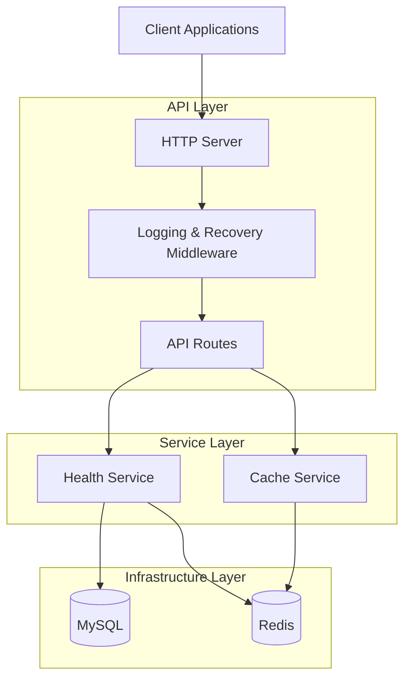

# Health Checker Website Backend

A production-ready, containerized, and scalable Health Monitoring Backend built with **Golang**, **MySQL**, **Redis**, **Docker**, and **Docker Compose**, following **Clean Architecture** principles and industry best practices.

---

# 🌐 Service URLs

| Service         | URL                                      |
| --------------- | ---------------------------------------- |
| API             | http://localhost:8000                    |
| Health Check    | http://localhost:8000/health             |
| Detailed Health | http://localhost:8000/health/details     |
| Swagger         | http://localhost:8000/swagger/index.html |
| phpMyAdmin      | http://localhost:8080                    |

---

# Table of Contents

- Overview
- Features
- Architecture
- Tech Stack
- Project Structure
- Quick Start
- Environment Configuration
- Docker Services
- API Documentation
- Database Access
- Swagger Documentation
- Development Workflow
- Docker Commands
- Health Checks
- Troubleshooting
- Production Deployment
- Security Best Practices

---

# 🚀 Overview

The Health Checker Website Backend provides real-time monitoring and verification of critical system components.

### Core Responsibilities

- Application Health Monitoring
- MySQL Connectivity Verification
- Redis Connectivity Verification
- Cache Management APIs
- Structured Logging
- Graceful Shutdown
- Dockerized Deployment
- Production-Ready Configuration

---

# ✨ Features

### Application Monitoring

- Health Check Endpoint
- Detailed System Status Endpoint
- Uptime Monitoring
- Dependency Status Verification

### Database Features

- MySQL Connection Pooling
- Persistent Database Storage
- Automatic Health Monitoring

### Cache Features

- Redis Connection Pooling
- Redis Persistence (AOF + RDB)
- Cache Testing Endpoints

### Production Features

- Docker Multi-stage Build
- Non-root Containers
- Structured JSON Logging
- Graceful Shutdown
- Environment-based Configuration
- Health Checks
- Dedicated Docker Network

---

# 🏗 Architecture



---

# 🛠 Tech Stack

| Layer            | Technology     |
| ---------------- | -------------- |
| Backend          | Golang         |
| Database         | MySQL 8        |
| Cache            | Redis 7        |
| Database UI      | phpMyAdmin     |
| Containerization | Docker         |
| Orchestration    | Docker Compose |
| Logging          | slog           |
| Configuration    | .env           |

---

# 📁 Project Structure

```text
health-checker/

├── cmd/
│   └── server/
│       └── main.go
│
├── internal/
│   ├── config/
│   │   └── config.go
│   │
│   ├── database/
│   │   └── mysql.go
│   │
│   ├── redis/
│   │   └── redis.go
│   │
│   ├── handlers/
│   │   ├── health_handler.go
│   │   └── cache_handler.go
│   │
│   ├── middleware/
│   │   ├── logging.go
│   │   └── recovery.go
│   │
│   ├── routes/
│   │   └── routes.go
│   │
│   └── services/
│       ├── health_service.go
│       └── cache_service.go
│
├── migrations/
│   └── init.sql
│
├── configs/
│
├── Dockerfile
├── docker-compose.yml
├── .env
├── .gitignore
├── go.mod
├── go.sum
└── README.md
```

---

# ⚡ Quick Start

## Clone Repository

```bash
git clone <repository-url>
cd health-checker
```

## Start All Services

```bash
docker compose up --build
```

## Run In Background

```bash
docker compose up -d --build
```

## Verify Containers

```bash
docker compose ps
```

---

# ⚙️ Environment Configuration

Create a `.env` file in the project root.

```env
APP_NAME=Health Checker
APP_ENV=development
APP_PORT=8000

DB_HOST=mysql
DB_PORT=3306
DB_NAME=health_checker
DB_USER=health_user
DB_PASSWORD=health_password

MYSQL_DATABASE=health_checker
MYSQL_USER=health_user
MYSQL_PASSWORD=health_password
MYSQL_ROOT_PASSWORD=root_password

REDIS_HOST=redis
REDIS_PORT=6379
REDIS_PASSWORD=
REDIS_DB=0
```

---

# 🐳 Docker Services

| Service    | Port | Purpose             |
| ---------- | ---- | ------------------- |
| API        | 8000 | Golang Backend      |
| MySQL      | 3306 | Database            |
| Redis      | 6379 | Cache               |
| phpMyAdmin | 8080 | Database Management |

---

# 🌐 Service URLs

| Service         | URL                                      |
| --------------- | ---------------------------------------- |
| API             | http://localhost:8000                    |
| Health Check    | http://localhost:8000/health             |
| Detailed Health | http://localhost:8000/health/details     |
| Swagger         | http://localhost:8000/swagger/index.html |
| phpMyAdmin      | http://localhost:8080                    |

---

# 📚 API Documentation

## Health Check

### Request

```http
GET /health
```

### Response

```json
{
  "status": "ok",
  "service": "health-checker",
  "mysql": "connected",
  "redis": "connected",
  "timestamp": "2026-06-06T10:00:00Z"
}
```

---

## Detailed Health Check

### Request

```http
GET /health/details
```

### Response

```json
{
  "api": "healthy",
  "mysql": {
    "status": "healthy"
  },
  "redis": {
    "status": "healthy"
  },
  "uptime": "24h0m0s"
}
```

---

## Save Cache Data

### Request

```http
POST /cache
```

```json
{
  "key": "health",
  "value": "ok"
}
```

### Response

```json
{
  "message": "cached successfully"
}
```

---

## Retrieve Cache Data

### Request

```http
GET /cache?key=health
```

### Response

```json
{
  "key": "health",
  "value": "ok"
}
```

---

# 🗄 Database Access

## phpMyAdmin

URL:

```text
http://localhost:8080
```

### Standard User

| Field    | Value           |
| -------- | --------------- |
| Username | health_user     |
| Password | health_password |

### Root User

| Field    | Value         |
| -------- | ------------- |
| Username | root          |
| Password | root_password |

---

## Direct Database URL

```text
http://localhost:8080/index.php?route=/database/structure&db=health_checker
```

---

# 📖 Swagger Documentation

Access Swagger UI:

```text
http://localhost:8000/swagger/index.html
```

---

# 👨‍💻 Development Workflow

## Run Locally

Update `.env`

```env
DB_HOST=localhost
REDIS_HOST=localhost
```

Run application:

```bash
go run cmd/server/main.go
```

---

## Dependency Management

Add dependency:

```bash
go get <package-name>
```

Cleanup modules:

```bash
go mod tidy
```

---

# 🐳 Docker Commands

## Build & Start

```bash
docker compose up -d --build
```

## Stop Containers

```bash
docker compose down
```

## Stop & Remove Volumes

```bash
docker compose down -v
```

## View Logs

```bash
docker compose logs -f
```

## View Running Containers

```bash
docker compose ps
```

---

# 🔍 Health Checks

### MySQL

```bash
mysqladmin ping
```

### Redis

```bash
redis-cli ping
```

### API Dependency

The API container starts only when:

- MySQL is healthy
- Redis is healthy

Configured via:

```yaml
depends_on:
  mysql:
    condition: service_healthy

  redis:
    condition: service_healthy
```

---

# 🛠 Troubleshooting

## MySQL Connection Error

Check logs:

```bash
docker compose logs mysql
```

Verify credentials:

- DB_HOST
- DB_USER
- DB_PASSWORD

---

## Redis Connection Error

Check logs:

```bash
docker compose logs redis
```

---

## Port Already In Use

Ensure these ports are available:

```text
8000
8080
3306
6379
```

---

# 🚀 Production Deployment

## Recommended Setup

```text
Internet
    │
    ▼
Nginx / Caddy
    │
    ▼
Health Checker API
    │
 ┌──┴──┐
 ▼     ▼
MySQL Redis
```

### Production Checklist

- Change all default passwords
- Enable HTTPS
- Use Reverse Proxy
- Restrict Database Ports
- Enable Log Aggregation
- Enable Monitoring & Alerting
- Configure Automated Backups

---

# 🔐 Security Best Practices

### Container Security

- Run containers as non-root users
- Use multi-stage Docker builds
- Minimize image size

### Database Security

- Strong passwords
- Private network access
- Regular backups

### Application Security

- Input validation
- Request timeouts
- Graceful error handling
- Environment-based secrets

---

# 📄 License

This project is intended for educational, development, and production deployment purposes following modern Golang backend best practices.
